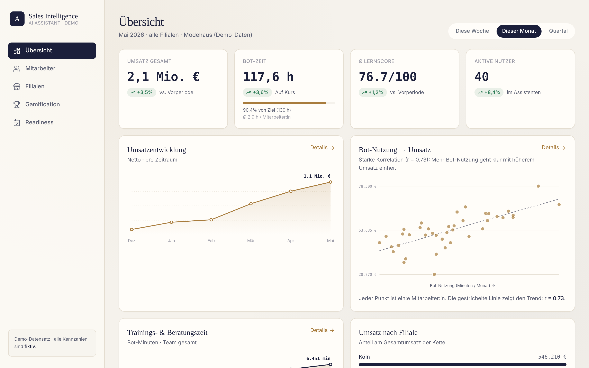
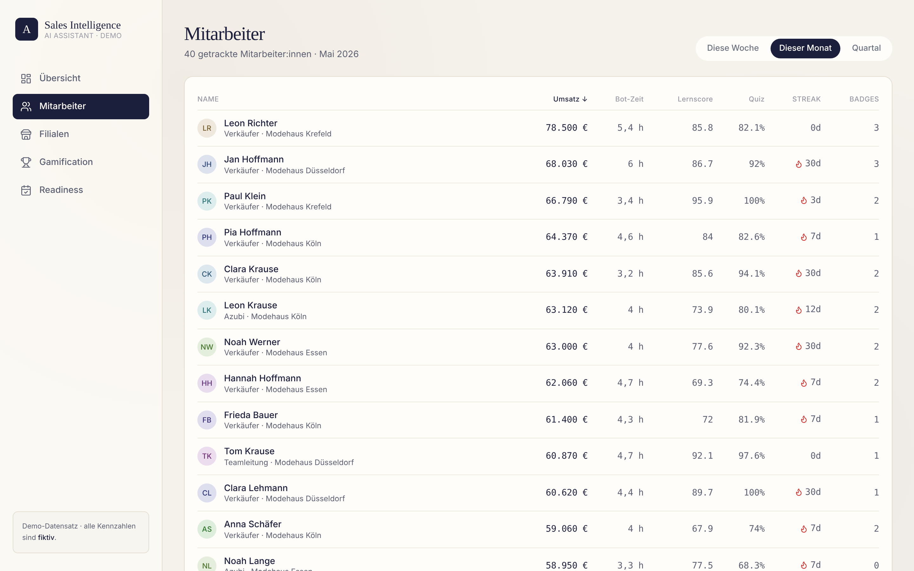
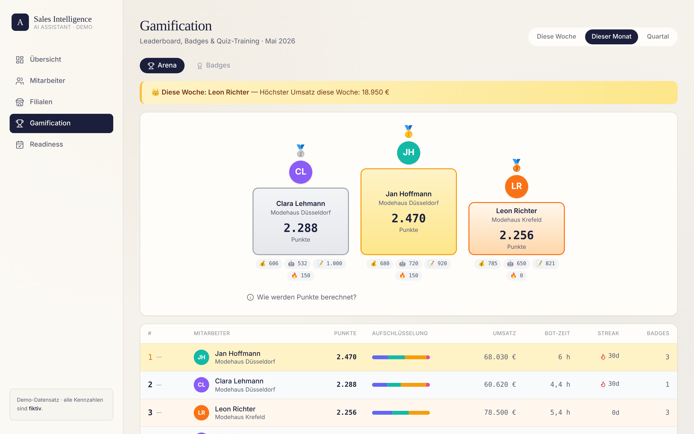

<div align="center">

# AI Sales Assistant Analytics Dashboard

**Does an AI sales assistant actually make store staff sell more?**
A management & staff dashboard for a multi-store fashion retailer that puts bot usage, learning scores and revenue side by side and makes the correlation visible.




</div>

> **Note:** This is an anonymised version of a client prototype built in a consulting project. All company names were removed and **all data is synthetic** (deterministic mock generator, seed 2026).

## Highlights

- **Bot usage vs. revenue:** scatter plot with Pearson *r* ≈ 0.73, ROI band and revenue-per-bot-hour KPI
- **Five views:** Overview, Employees, Stores, Gamification (leaderboard, badges, quizzes), Seasonal Readiness score before a collection launch
- **Typed API contract:** Pydantic schemas in the backend mirrored 1:1 as TypeScript types in the frontend
- **No chart library:** all charts are hand-rolled SVG components
- **Easy to connect real data:** the mock generator is the only data source; replace it with a DB/CSV loader that returns the same shapes and nothing else changes

## Screenshots

| Employees | Gamification |
|---|---|
|  |  |

## Architecture

```text
ai-sales-dashboard/
├── backend/            FastAPI, serves all data as a JSON API
│   └── app/
│       ├── models/     Pydantic schemas = the API contract
│       ├── data/       deterministic mock-data generator
│       ├── services/   analytics (KPIs, correlation, aggregation)
│       └── api/        route definitions (/api/...)
└── frontend/           SvelteKit (Svelte 5 runes + Tailwind v4 + TypeScript)
    └── src/
        ├── lib/api/          typed API client
        ├── lib/components/   sidebar, SVG charts, UI building blocks
        ├── lib/types.ts      TS mirror of the Pydantic schemas
        └── routes/           overview, employees, stores, gamification, readiness
```

**Why FastAPI instead of a pure SvelteKit app?** The next step is the chatbot itself: an LLM agent with function calling, speech-to-text and a video-to-Markdown transcription pipeline. That is Python-native, so the bot can later be added as just another router module under `app/api/` without switching stacks.

## Getting started

You need two terminals (backend and frontend run in parallel).

**Backend** (port 8000)

```bash
cd backend
python -m venv .venv
source .venv/bin/activate        # Windows: .venv\Scripts\activate
pip install -r requirements.txt
uvicorn app.main:app --reload --port 8000
```

Swagger docs: http://localhost:8000/docs

**Frontend** (port 5173)

```bash
cd frontend
npm install
npm run dev
```

Open http://localhost:5173. The frontend reads the backend URL from `PUBLIC_API_URL` (default `http://localhost:8000`); copy `frontend/.env.example` to `frontend/.env` to point it elsewhere.

## Extending it

- **The API contract is the source of truth.** `backend/app/models/schemas.py` and `frontend/src/lib/types.ts` must stay in sync.
- **New KPI:** add an endpoint in `app/api/`, a method in `frontend/src/lib/api/client.ts`, load it in the page's `+page.ts` and render it in `+page.svelte`.
- **Re-skin:** all design tokens (colours, fonts) live in `frontend/src/app.css` (`@theme`).

More detail: [CODEBASE_OVERVIEW.md](CODEBASE_OVERVIEW.md) (German).

## Author

Built by [Arian Sharifi-Tabar](https://github.com/sorassword).
